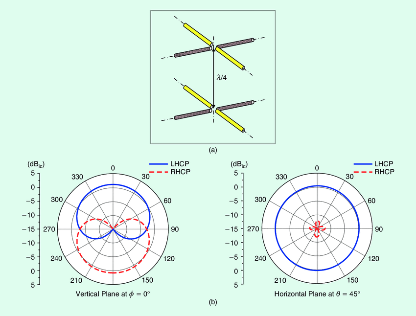
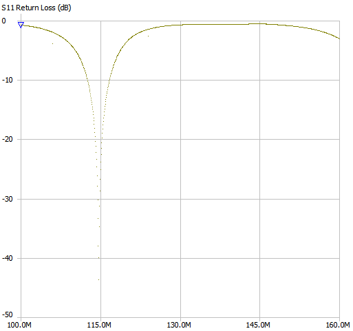
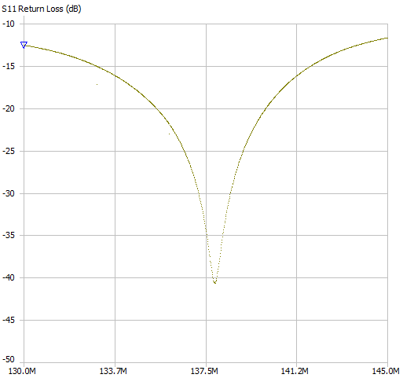
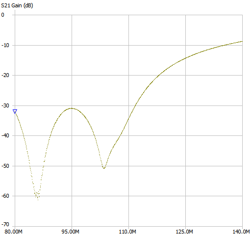
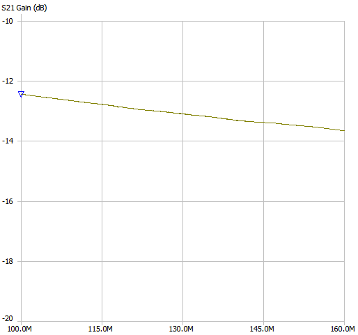
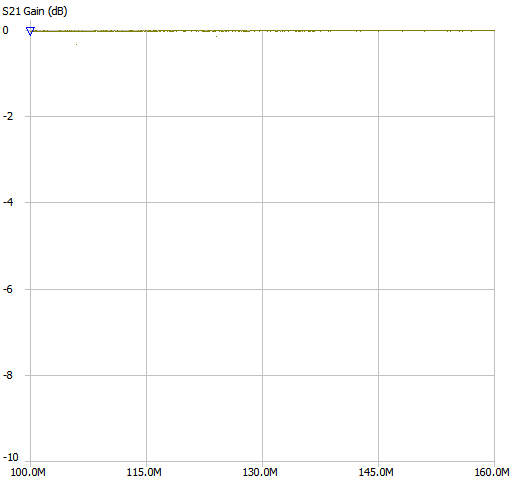

## O projekcie

Celem projektu jest stworzenie stacji bazowej satNOGS. satNOGS powstał jako projekt służący głównie operatorom amatorskich satelitów cubesat, często wysyłanych na orbitę przez różne uczelnie w ramach programów naukowych. Takie jednostki często nie mają odpowiednich zasobów na dostęp do profesjonalnych sieci stacji bazowych, i mogą być ograniczone do odbioru telemetrii ze swoich satelitów np. tylko wtedy, gdy przelatują nad swoją uczelnią. Tu wkracza satNOGS z pomysłem, by utworzyć otwartoźródłową sieć takich prostych stacji bazowych rozsianych po całym świecie.

## Wykorzystany sprzęt

* Raspberry Pi 5 (8GB ram)
    * zasilacz usb-c 27W
    * obudowa z wentylatorem
    * SSD SATA 240GB (*) + adapter USB-SATA Ugreen
* RTL-SDR V3
* antena Diamond BC100S
* przewód antenowy (aktualnie RG174, docelowo najlepiej RG58)
* zestaw adapterów złącz antenowych
    * PL-259 &#8594; SMA female
    * SMA female &#8594; SMA female

* (opcjonalny) filtr bandstop FM, w naszym przypadku bardzo przydatny - niedaleko miejsca montażu stacji znajduje się kilowatowy nadajnik radia FM którego sygnał przeciąża SDRa, co skutkuje zwiększonym szumem i słabszą jakością odbioru
* (opcjonalny) chiński wzmacniacz LNA [TQP3M9037](pl.aliexpress.com/item/1005005576142216.html), kosztuje ok. 30zł, według internautów jest o wiele lepszy od popularniejszego [SPF5189Z](https://pl.aliexpress.com/item/1005007995348208.html)

(*) dysk 240GB jest zdecydowanie zbyt duży jeśli nie zdecydujemy się na zapisywanie basebandu z odebranych transmisji. Domyślnie ta opcja jest wyłączona, a pliki (nazywane [artefaktami](https://wiki.satnogs.org/Artifacts)) po wysłaniu na serwery satNOGS są usuwane z pamięci lokalnej.

### Tor RF
Antena &#8594; adapter PL-259 do SMA female &#8594; filtr bandstop FM &#8594; ok. 1m kabla TV 75 Ohm &#8594; LNA TQP3M9037 &#8594; 10m kabla RG174 &#8594; 3m kabla RG174 &#8594; 30cm kabel SMA female do SMA female &#8594; RTL-SDR V3

## Antena
Antena Diamond BC-100S jest anteną przeznaczoną do odbioru sygnałów spolaryzowanych pionowo w paśmie UHF (115 - 174 MHz, z możliwością dostrojenia). Anteny 5/8 $\lambda$ mają charakterystykę bardzo skupioną na horyzoncie, z dużym spadkiem zysku przy ok. 30 i 90 stopniach.

Zródło: [practicalantennas.com](https://practicalantennas.com/designs/verticals/5eights/)

Dla naszego zastosowania lepsza byłaby antena typu turnstile lub QFH, ponieważ mają bardziej równomierne charakterystyki zysku i działają w polaryzacji kołowej.

Źródło: [researchgate.net](https://www.researchgate.net/figure/A-double-turnstile-antenna-in-free-space-a-The-3-D-view-and-b-its-radiation-pattern_fig2_282776048)
##### Polaryzacja
Anteny turnstile i QFH działają w polaryzacji kołowej, czyli takiej jak ta, w jakiej operują satelity na których będziemy się skupiać. *Polarisation mismatch loss* między sygnałem transmitowanym w polarycji kołowej, a anteną odbiorczą spolaryzowaną liniowo to 3dB, więc mimo ogólnie dużego zysku anteny Diamond BC100S, wciąż tracimy nieco na jakości odbioru. Z naszym setupem możemy się spodziewać w miarę dobrego pokrycia na horyzoncie (duży zysk anteny zniesie częściowo stratę niedopasowania polaryzacji), ale przeloty overhead (duża elewacja, powyżej 60 stopni) będą traciły podwójnie.
Źródło: [microwaves101.com](https://www.microwaves101.com/encyclopedias/polarization-mismatch-between-antennas)

#### Satelity
Obecnie większość amatorskich satelitów transmituje telemetrię w paśmie 70cm, czyli ok. 430MHz. Jest to dyktowane głównie dostępnością tego pasma oraz rozmiarem wykorzystanej anteny (amatorskie satelity nie są duże). My dysponujemy anteną Diamond BC100S przystosowaną do odbioru częstotliwości 115 MHz - 160 MHz. Na tym paśmie można spotkać głównie satelity pogodowe (137 MHz) oraz transmisje z ISS (145 MHz).
 Skupimy się przede wszystkim na satelitach pogodowych NOAA i Meteor:

| l.p. |   satelita  | częstotliwość (MHz) |                          komentarz                         |
|:----:|:-----------:|:-------------------:|:----------------------------------------------------------:|
|    1 |   NOAA 15   |        137.62       |                    sygnał analogowy APT                    |
|    2 |   NOAA 18   |       137.9125      | sygnał analogowy APT. Satelita poddany dekomisji 6.06.2025 |
|    3 |   NOAA 19   |        137.1        |                    sygnał analogowy APT                    |
|    4 | Meteor M2-3 |        137.9        |                     sygnał cyfrowy LRPT                    |
|    5 | Meteor M2-4 |        137.9        |                     sygnał cyfrowy LRPT                    |

W trakcie trwania projektu, satelita NOAA 18 został poddany dekomisji i całkowicie wyłączony w skutek awarii transceivera używanego do TT&C (Telemetry, Tracking and Command). Administracja NOAA porzuciła wsparcie dla satelitów 15 i 19 z powodu cięcia kosztów. Istnieje szansa, że do końca roku pozostałe satelity również zostaną wyłączone i jedynymi satelitami w paśmie VHF pozostaną Meteory.

## Konfiguracja środowiska

#### Instalacja systemu na Raspberry
Na dysku zainstalowano system Raspbian 64 bit za pomocą [Raspberry Pi Imager](https://www.raspberrypi.com/software/). Po wybraniu właściwej płytki, wersji systemu i docelowego dysku, kreator zapyta, czy chcemy customizować instalację. Serwer skonfigurujemy jako <em>headless</em>, więc należy wybrać "<em>edit settings</em>", następnie uzupełnić pole z nazwą użytkownika i hasłem, i ostatecznie włączyć serwer SSH w drugiej zakładce. Po zainstalowaniu systemu na dysk, zostanie on automatycznie odłączony - można go podłączyć do Raspberry i przejść do kolejnego kroku.

##### Konfiguracja SSH
Do świeżo uruchomionego Raspberry łączymy się przez ssh poleceniem `ssh satpi@192.168.50.26`. `satpi` to wybrana na etapie konfiguracji nazwa użytkownika, zaś adres IP najlepiej sprawdzić w panelu administracyjym routera, a jeśli nie mamy do niego dostępu - programem *nmap* lub [Advanced IP Scanner](https://www.advanced-ip-scanner.com/pl/). Dla ułatwienia pracy zalecane jest wklejenie swojego klucza publicznego do `/home/satpi/.ssh/authorized_keys` - nie będzie trzeba wpisywać za każdym razem ustalonego wcześniej hasła.

##### Instalacja klienta VPN
Aby można było połączyć się z Raspberry nawet, gdy będziemy chcieli zainstalować stację satNOGS poza naszą siecią lokalną, albo aby dać do niego dostęp współpracownikom, należy uzbroić je w tunel VPN. W naszym przypadku serwerem VPN jest self-hosted instancja Wireguarda działająca na innym komputerze klasy Raspberry (VPS to dodatkowy koszt, a niektórzy ISP wciąż oferują publiczne adresy IPv4 🙏). Na Raspberry instalujemy Wireguarda:
`sudo apt update && sudo apt upgrade`
`sudo apt install wireguard`
`sudo apt install openresolv` (bez tego wireguard nie utworzy tunelu)

Na serwerze generujemy plik konfiguracyjny klienta wyglądający mniej więcej tak:
<pre>[Interface]
PrivateKey = [...]
Address = 10.154.37.6/24
DNS = 1.1.1.1, 1.0.0.1
[Peer]
PublicKey = [...]
PresharedKey = [...]
Endpoint = [VPN_SERVER_IP]:51820
AllowedIPs = 10.154.37.0/24
PersistentKeepAlive = 25</pre>
I przeklejamy jego treść na Raspberry:
`sudo nano /etc/wireguard/satnogs.conf`

**Pole <em>PersistentKeepAlive</em> jest kluczowe**. Bez niego ruch z zewnątrz nie dociera do Raspberry, nie da się połączyć z nim przez ssh ani spingować. Problem ustawał tymczasowo po wysłaniu z Raspberry pingu na inną maszynę w sieci VPN. Jest to związane z działaniem firewalla i zamykaniem nieaktywnych połączeń.
Sprawdzamy czy VPN działa jak powinien:
`sudo wg-quick up satnogs`
Upewniamy się czy połączenie zostało prawidłowo nawiązane:
<pre>PING 10.154.37.1 (10.154.37.1) 56(84) bytes of data.
64 bytes from 10.154.37.1: icmp_seq=1 ttl=64 time=0.686 ms
64 bytes from 10.154.37.1: icmp_seq=2 ttl=64 time=0.693 ms</pre>

Wszystko jest ok, więc można skonfigurować Wireguarda jako usługę systemd, żeby tunel tworzył się przy starcie systemu:
<pre>sudo systemctl enable wg-quick@satnogs.service
sudo systemctl start wg-quick@satnogs</pre>
Teraz możemy łączyć się do Raspberry gdziekolwiek będzie miało dostęp do internetu. Będzie to przydatne w momencie przemieszczenia stacji bazowej satNOGS.

###### Alternatywa dla Wireguard
Ciekawą i bardzo prostą w instalacji alternatywą dla Wireguard jest [Tailscale](https://tailscale.com/). To rozwiązanie działające out-of-the-box, choć darmowy tier ma ograniczenie do 3 użytkowników w zespole.

#### Instalacja Dockera
Preferowaną metodą uruchomienia klienta satNOGS jest zrobienie tego w kontenerze Dockera. Docker został zainstalowany zgodnie z [oficjalnym poradnikiem](https://docs.docker.com/engine/install/debian/#install-using-the-repository). Domyślnie nasz użytkownik nie należy do grupy dockera, i wszystkie polecenia należy wykonywać z wykorzystaniem `sudo`. Aby to zmienić, wykonujemy następujące kroki (wg. poradnika ze [stackoverflow](https://stackoverflow.com/questions/48957195/how-to-fix-docker-got-permission-denied-issue)):
<pre>sudo groupadd docker
sudo usermod -aG docker $USER 
newgrp docker
sudo systemctl restart docker</pre>
Weryfikujemy prawidłowe działanie Dockera poleceniem `docker run hello-world`. Powinien zostać pobrany obraz testowy, a w konsoli wyświetli się komunikat informujący o sukcesie.
### Instalacja klienta satNOGS - wersja minimalna
Uruchamianie klienta satNOGS jako dockerowego kontenera ma wiele zalet:
* konfiguracja przechowywana w jednym pliku
* łatwość wprowadzania zmian 
* łatwe zarządzanie zasobami
* skalowalność (można posiadać wiele stacji na jednym serwerze)
* jeśli coś nie zepsujemy, nie "krzywdzimy" konfiguracji systemowej hosta, problem jest self-contained w kontenerze i można go po prostu usunąć i stworzyć od nowa

W tym celu wykorzystamy [oficjalny obraz](https://gitlab.com/librespacefoundation/satnogs/satnogs-client/-/tree/master?ref_type=heads), który wpierw będziemy musieli zbudować.
<pre>sudo apt update && sudo apt install git
git clone https://gitlab.com/librespacefoundation/satnogs/satnogs-client.git
cd satnogs-client
docker compose build</pre> 
Po wykonaniu tych czynności, powinniśmy mieć w pamięci obraz `satnogs-client`. Można to zweryfikować:
<pre>satpi@pi-station:~ $ docker image ls
REPOSITORY                  TAG       IMAGE ID       CREATED         SIZE
satnogs-client              latest    a445945dd4d5   3 hours ago     2.26GB</pre>

Teraz możemy utworzyć w katalogu domowym folder o nazwie adekwatnej nazwie - np. `gs4063` (groundstation 4063, gdzie 4063 to nasz numer stacji satNOGS). W folderze tworzymy dwa pliki: `compose.yml` i `.env`. Plik `compose.yml` będzie wyglądał tak (bez zmian):
<pre>services:

  rigctld:
    image: 'librespace/hamlib:4.0'
    user: '999'
    read_only: true
    environment:
      MODEL: '1'
    restart: 'unless-stopped'
    command: 'rigctld'

 satnogs_client:
    image: 'satnogs-client'
    user: '500:500'
    read_only: true
    device_cgroup_rules:
      - 'c 189:* rwm'
    command: 'satnogs-client'
    volumes:
      - type: 'tmpfs'
        target: '/tmp'
      - type: 'volume'
        target: '/var/lib/satnogs-client'
      - '/dev/bus/usb:/dev/bus/usb'
      - "./data:/iq"
    restart: 'unless-stopped'
</pre>
Plik ".env" uzupełniamy na wzór poniższego:

<pre>
SATNOGS_API_TOKEN: '...' #uzupełniamy własnym tokenem
SATNOGS_SOAPY_RX_DEVICE: 'driver=rtlsdr'
SATNOGS_ANTENNA: 'RX' #jeśli wybrano rtlsdr, zostawiamy "RX"
SATNOGS_RX_SAMP_RATE: '1.024e6'
SATNOGS_RF_GAIN: "32.8" #tu należy poeksperymentować
SATNOGS_STATION_ID: '4063'
SATNOGS_STATION_ELEV: '160'
SATNOGS_STATION_LAT: '51.20'
SATNOGS_STATION_LON: '17.40'
#SATNOGS_LOG_LEVEL: "DEBUG" #można odkomentować jeśli doswiadczamy problemów
SATNOGS_RIG_IP: 'rigctld'
SATNOGS_ROT_ENABLED: "False"
ENABLE_IQ_DUMP: "True" 
IQ_DUMP_FILENAME: "/iq/file"
SATNOGS_POST_OBSERVATION_SCRIPT: "/iq/satnogs-post.sh {{ID}}"
</pre>

##### (bardzo opcjonalne) Archiwizowanie danych
Na tym etapie archiwizowanie danych przedstawione jest raczej jako ciekawostka i jest **ściśle odradzane**. Ma sens dopiero jeśli korzystamy z drugiego poradnika "na wypasie".

Jeśli stacja ma archiwizować odebrane dane, należy ustawić argument `ENABLE_IQ_DUMP` na `True` oraz wskazać ścieżkę, gdzie plik ma zostać zapisany (`IQ_DUMP_FILENAME`). Ścieżka musi być widoczna dla kontenera, oraz kontener musi mieć do niej prawa. W tym celu utworzono folder współdzielony między kontenerem a hostem, razem z  plikiem "file" i nadano mu odpowiednie prawa.

<pre>
mkdir data
touch data/file
sudo chown -R 500:500 data/
</pre> 
Plik z surowymi danymi będzie nadpisywany z każdym kolejnym przelotem satelity. Aby temu zapobiec, należy stworzyć skrypt zmieniający jego nazwę po zakończeniu zapisywania. Skrypt również musi należeć do użytkownika `500` i posiadać flagę wykonywalności - `chmod +x satnogs-post.sh`.

<pre>
#!/bin/bash
IQ_NAME=/iq/"$1".raw
echo "copying IQ file -> $IQ_NAME "
cp /iq/file "$IQ_NAME"
echo "OK copied /iq/file to $IQ_NAME"
</pre>
Teraz archiwalne zapisy przelotów będą zapisywane w folderze `data`. Jest tylko jedno "ale" - plik będzie surowym zapisem binarnym, i nie będzie dało się go otworzyć w popularnych programach typu [SDRSharp](https://airspy.com/download/) (a przynajmniej tak, żeby miał sens). Należy go zatem przekonwertować do formatu `.wav`, ale żeby to zrobić, należy znać sample rate z jakim został zapisany. Nie jest to trywialne, ponieważ klient satNOGS decyduje o tym na podstawie paru parametrów. Jest to dokładniej wyjaśnione w dalszej części dokumentacji.

##### Uruchomienie
Kontener uruchamiamy wchodząc w folder z plikiem compose, za pomocą komendy `docker compose up -d`.

#### Autoscheduling
W obecnym stanie rzeczy, jakiekolwiek przeloty muszą zostać zaplanowane ręcznie, co nie jest optymalne, jeśli chcemy "zapomnieć" o naszej stacji i dać jej działać w tle. Zautomatyzujemy to korzystając z oficjalnego projektu [satnogs auto scheduler](https://gitlab.com/librespacefoundation/satnogs/satnogs-auto-scheduler).

<pre>
git clone https://gitlab.com/librespacefoundation/satnogs/satnogs-auto-scheduler.git
cd satnogs-auto-scheduler
</pre>
W `Dockerfile` trzeba wprowadzić zmianę i wyraźnie zaznaczyć wersję `ephem` która zostanie pobrana (4.1.5), inaczej instalacja się wysypie:
<pre>
# Build wheel for ephem
RUN --mount=type=cache,target=/root/.cache/pip \
    rm -rf /dist/ephem*.whl && \
    pip wheel --wheel-dir /dist/ 'ephem==4.1.5'
</pre>
Następnie budujemy:
<pre>
docker compose build
</pre>
Modyfikujemy lekko plik `docker-compose.yml`:

<pre>
services:
  satnogs_auto_scheduler:
    build:
      context: .
    image: satnogs-auto-scheduler
    user: '999'
    read_only: true
    entrypoint: "/data/entrypoint.sh"
    env_file:
      - ./station.env
    volumes:
      - type: 'tmpfs'
        target: '/tmp'
      - "./data:/data"
</pre>

Plik `station.env` uzupełniamy adekwatnymi kluczami API i numerem ID naszej stacji:
<pre>
#Your SatNOGS station ID
SATNOGS_STATION_ID="4063"

#Your SatNOGS network API token
SATNOGS_API_TOKEN="..."

#Your SatNOGS DB API token (wbrew dokumentacji - jednak jest WYMAGANY)
SATNOGS_DB_API_TOKEN="..."
</pre>
Klucz API DB pobieramy ze strony: [db.satnogs.org](https://db.satnogs.org/). W prawym górnym rogu klikamy okrągłą ikonę, a następnie pole "Settings / API Token".

W folderze `data/` tworzymy skrypt `entrypoint.sh`, który będzie co określony czas pobierał dane o przelotach i automatycznie je planował:

<pre>
#!/bin/bash
SLEEP_TIMER=3000
SATNOGS_GS_ID=4063
while true
do
        schedule_single_station.py -s "$SATNOGS_GS_ID" -T -d 1.5
        echo "scheduled something, now sleeping for $SLEEP_TIMER seconds"
        sleep "$SLEEP_TIMER"
done
</pre>
`SATNOGS_GS_ID` uzupełniamy ID naszej stacji, `SLEEP_TIMER` ustawiamy na jakiś czas, w tym przypadku 3000 sekund = 50 minut. Flaga `-d` określa na ile godzin do przodu planujemy obserwacje (1.5h), flaga `-T` musi być obecna, jeśli nasza stacja jest w fazie testowej. Skrypt musi mieć własciciela `999` i flagę wykonywalności.
##### Uruchomienie
Kontener uruchamiamy wchodząc w folder z plikiem compose, za pomocą komendy `docker compose up -d`.

#### Instalacja klienta satNOGS (manualna) - skomplikowana wersja "na wypasie" 
SatNOGS to duży projekt, ale jego oficjalne obrazy nie wykorzystują wszystkich możliwości. Skupimy się na forku [kng/satnogs-client-docker](https://github.com/kng/satnogs-client-docker), który rozszerza możliwości oryginalnych obrazów. 
* automatyczne obliczanie samplerate zapisanego basebandu
* rozbudowane skrypt pre- i post-obserwacyjne
* integracja [SatDump](https://github.com/SatDump/SatDump/tree/nightly) - najbardziej wszechstronnego oprogramowania do demodulowania i dekodowania sygnałów satelitarnych
* obsługa pipeline do odbierania obrazów z satelitów Meteor 

Mimo bycia dość rozbudowanym, projekt jest słabo udokumentowany i wymagał pewnej inżynierii wstecznej i modyfikacji paru plików, aby działał jak powinien. Szczególnie uciążliwa okazała się sytuacja, w której dockerowy [obraz satnogs](https://hub.docker.com/r/librespace/satnogs-client) z tagu master uległ aktualizacji i rozsypało się wszystko, co tylko mogło. Niemniej, w naszym poradniku wprowadzimy skrypt, który ogranicza żmudne wprowadzanie poprawek do zera, a użytkownik musi jedynie skonfigurować gotową stację.

##### Instalacja obrazu bazowego
Zacznijmy od podstaw. Tworzymy folder o adekwatnej nazwie, np. `gs4063`. Będziemy w nim przechowywać:
* plik `compose.yml`
* plik `station.env`
* folder z repozytorium 
* folder wspóldzielony między hostem a kontenerem

Będąc w folderze `gs4063` klonujemy repozytorium:
<pre>
git clone https://github.com/kng/satnogs-client-docker.git
cd satnogs-client-docker
cd addons
</pre>
Przed zbudowaniem obrazu musimy poprawić parę rzeczy po autorze.

###### Modyfikacja Dockerfile
W pliku `Dockerfile` komentujemy linijki odpowiedzialne za instalacje modułów `satnogs-monitor/monitor`, `beesat-sdr` - te moduły nie będą nam potrzebne, a mają problemy z dependencjami i sypią błędami przy próbie instalacji. 

##### Załączanie bias-t
Jeśli antena podłączona jest do wzmacniacza zasilanego z bias-t (jak w naszym przypadku), musimy zarządzać włączaniem zasilania bias-t w RTL-SDR za pomocą skryptów pre/post. Jeśli nie posiadamy wzmacniacza, ten krok można pominąć. Jeśli nie posiadamy wzmacniacza, a nasza antena jest DC-zwarta (np. antena QFH lub turnstile), **NIE WOLNO** załączać bias-t! Może to uszkodzić wewnętrzną elektronikę SDR.
W skrypcie `scripts/satnogs-pre` dopisujemy linijki:
<pre>
rtl_biast -b 1 > /dev/null
echo "bias tee on"
</pre>
I analogicznie w skrypcie `scripts/satnogs-post`:
<pre>
rtl_biast -b 0 > /dev/null
echo "bias tee off"
</pre>

##### Obsługa SatDump
W skrypcie `scripts/satdump.sh` satdump jest wywoływany w momencie rozpoczęcia obserwacji. Ten skrypt jest całkowicie źle napisany - nieprawidłowe argumenty wywołania programu satdump, niedziałające uploadowanie wyników, zła obsługa zmiennych środowiskowych. Niemniej, nawet po wprowadzeniu poprawek do skryptu, zauważyliśmy, że o ile procesowanie na żywo dla NOAA APT działa jak powinno, to LRPT satelitów Meteor nie działa. Zapisanie basebandu z obserwacji i następnie zdekodowanie go "offline" wskazywało na to, że był to błąd satdumpa. Nie ma się czemu dziwić - jest to oprogramowanie eksperymentalne. Żeby temu zaradzić, postanowiono pozbyć się skryptu dekodującego na żywo na rzecz skryptu dekodującego sygnały po zakończeniu obserwacji. Żeby go stworzyć, najpierw trzeba wytłumaczyć jak satnogs-client zapisuje dane.

###### Obliczanie samplerate poszczególnych transmisji
Zmienna środowiskowa `SATNOGS_RX_SAMP_RATE` nie ma wpływu na to, w jakim samplerate zostanie zapisany obraz wodospadu na portalu satNOGS, ani w jakim samplerate zostanie nagrany baseband transmisji. Jest to niepokojące szczególnie dla Meteor LRPT, które ma ok. 115kHz szerokości, a satNOGS nagrywa je w 48kHz, co skutecznie uniemożliwia wykorzystanie takiego materiału do jakichkolwiek celów. Wynika to z tego, że satnogs-client nie posiada w swojej bibliotece [satnogs-flowgraphs](https://gitlab.com/librespacefoundation/satnogs/satnogs-flowgraphs) obsługi `LRPT`, mimo, że ten tryb znajduje się w bazie transmiterów satelitarnych (np. [Meteor M2-4](https://db.satnogs.org/satellite/VSVI-4798-5613-4587-2414#transmitters)). Najprostszy workaround dla tego problemu polega na pobraniu z repozytorium pliku [flowgraphs.py](https://gitlab.com/librespacefoundation/satnogs/satnogs-client/-/blob/master/satnogsclient/radio/flowgraphs.py) i zmodyfikowaniu go, aby transmisje `LRPT` były obsługiwane przez pipeline np. `FSK`. Może to powodować powstawanie fałszywych danych, ponieważ LRPT to sygnał modulowany QPSK, ale nie ma to wpływu na zapis baseband IQ.
Zmodyfikowany plik `flowgraphs.py` zamieszczono w folderze z dokumentacją. Tuż przed końcem pliku `Dockerfile` należy dodać dyrektywę:
<pre>
COPY flowgraphs.py /usr/local/lib/python3.9/dist-packages/satnogsclient/radio/
</pre>

Świetnie. Teraz mamy pewność, że surowe dane z obserwacji będą zapisywane z odpowiednią szerokością pasma. Jednakże są to dane w postawi surowej, binarnej. Satdump (lub inne programy do odsłuchu) są w stanie otworzyć takie pliki, ale będą "zniekształcone", tzn. szerokość pasma nie będzie się zgadzała z rzeczywistą. Rozwiążemy to przez opakowanie pliku `raw` do kontenera `wav` - jest to format powszechnie obsługiwany przez programy do odsłuchu basebandu, w jego nagłówku są zawarte wszystkie informacje potrzebne do prawidłowego jego otwarcia. Wykorzystamy program `sox`, wywoływany jest w ten sposób:
<pre>sox -t raw -b 16 -e signed-integer -r "$SAMP" -c 2 "$INPUT_RAW" "$OUTPUT_WAV"</pre> 
gdzie `$SAMP` to samplerate zapisanego sygnału.

###### Dekodowanie offline w SatDump
Satnogs-client zapisuje surowe dane w postaci doppler-corrected, czyli sygnał jest wycentrowany w jednym punkcie; satdump ogólnie tego nie lubi i deweloperzy aktywnie zniechęcają przed stosowaniem tej techniki. Niestety nie mamy na to wpływu, ale mimo to satdump radzi sobie z takim formatem danych nienajgorzej (jeśli dobrze to rozumiemy, to małe zmiany częstotliwości są w stanie odblokować [PLL](https://pl.wikipedia.org/wiki/P%C4%99tla_synchronizacji_fazy) co ma znaczenie przy sygnałach cyfrowych, gdzie sygnał trzeba "złapać"). W każdym razie, efektem końcowym tego rozdziału było opracowanie skryptu, który:
- parsuje NORAD z przekazanego przez program nadrzędny pliku `.tle`
- jeśli NORAD jest zgodny z którymś z obsługiwanych przez skrypt satelitów, baseband jest konwertowany z `raw` na `wav` przy użyciu programu `sox`
- wywołuje `satdump` z **właściwymi** argumentami
- usuwa niepotrzebny już plik `wav`
- po zdekodowaniu sprawdza czy wyprodukowano obrazy; jeśli tak - obrazy naniesione na mapę są usuwane (lepiej wyglądają "surowe')
- największy pozostały plik `.png` zostaje wysłany na serwery satnogs

##### Budowanie obrazu 
Wchodzimy w katalog `satnogs-client-docker/addons` zawierający `Dockerfile` i za pomocą komendy:
<pre>
docker build --build-arg BUILD_SATDUMP=1 -t lsf-addons-satdump .
</pre>
budujemy obraz o nazwie `lsf-addons-satdump`. SatDump to naprawdę duży program, w związku z czym instalacja może trwać nawet do 30 minut. Gdy będziemy chcieli zmienić coś w obrazie, np. zmodyfikować skrypty, kolejne budowanie będzie o wiele krótsze (skróci się do parunastu sekund), ponieważ Docker przechowuje poszczególne etapy budowania obrazu w cache. W razie gdyby coś dziwnego stało się ze scache'owanymi etapami budowy, można dopisać `--no-cache`, co wymusi zbudowanie obrazu całkowicie od nowa.

#### Konfiguracja 
Domyślny plik `docker-compose.yml` modyfikujemy według poniższego wzoru. Należy utworzyć folder `data` i zmienić jego właściciela na `500:500`.

<pre>
services:

  rigctld:
    image: librespace/hamlib:latest
    user: '999'
    read_only: true
    environment:
      MODEL: '1'
    restart: 'unless-stopped'
    command: 'rigctld'

  satnogs_client:
    image: lsf-addons-satdump  # lokalnie zbudowany obraz
    user: '500' # zmiana z 999
    init: true  # init is needed when launching processes in the background
    env_file:
      - ./station.env
    environment:
      SATNOGS_RIG_IP: 'rigctld'
      SATNOGS_RIG_PORT: '4532'
      FFTW_WISDOM: '/data/.fftw_wisdom' # prawdopodobnie niepotrzebne
    command: 'satnogs-client'  # default
    device_cgroup_rules:
      - 'c 189:* rwm'
    devices:
      - '/dev/bus/usb'
    volumes:
      - type: 'tmpfs'
        target: '/tmp'
      - type: 'volume'
        source: 'satnogs-client'
        target: '/var/lib/satnogs-client'
      - "./data:/data" # folder wspólny z hostem
    restart: 'unless-stopped'
    stop_grace_period: 1s
volumes:
  satnogs-client:  # persistent named volume for the station
</pre>

Plik `station.env` tworzymy analogicznie jak poprzednim razem, dodajemy dodatkowe flagi:

<pre>
SATNOGS_API_TOKEN='...' # klucz API satnogs
SATNOGS_SOAPY_RX_DEVICE= 'driver=rtlsdr'
SATNOGS_ANTENNA= 'RX' #domyślna wartość dla RTL-SDR
SATNOGS_RX_SAMP_RATE= '1.024e6' #szerokość samplowania 1MHz jest ok, 250kHz będzie zbyt wąskie
SATNOGS_RF_GAIN= "32.8" #eksperymentalnie dobrany gain
SATNOGS_STATION_ELEV= '160'
SATNOGS_STATION_ID= '4063'
SATNOGS_STATION_LAT= '51.2'
SATNOGS_STATION_LON= '17.4'
SATNOGS_ROT_ENABLED: "False"
#SATNOGS_LOG_LEVEL=INFO
SATNOGS_PRE_OBSERVATION_SCRIPT=satnogs-pre {{ID}} {{FREQ}} {{TLE}} {{TIMESTAMP}} {{BAUD}} {{SCRIPT_NAME}}
SATNOGS_POST_OBSERVATION_SCRIPT=satnogs-post {{ID}} {{FREQ}} {{TLE}} {{TIMESTAMP}} {{BAUD}} {{SCRIPT_NAME}}
UDP_DUMP_HOST=0.0.0.0

#ścieżki będą potrzebne jeśli zechcemy wysyłać do bazy satnogs obrazki(artefakty) pozyskane z satdumpa
SATNOGS_OUTPUT_PATH="/data/app/data"
SATNOGS_COMPLETE_OUTPUT_PATH="/data/app/data/complete"
SATNOGS_INCOMPLETE_OUTPUT_PATH="/data/app/data/incomplete"
SATNOGS_APP_PATH="/data/app"

#iq dump potrzebny do offline'owego procesowania w satdump
ENABLE_IQ_DUMP="True"
IQ_DUMP_FILENAME="/data/iq"
#poniższe można odkomentować, jeśli chcemy zachować surowe dane (zżera dużo miejsca, ale przydatne do debugowania)
#IQ_DUMP_RENAME="True"
#IQ_DUMP_COMPRESS="True"

METEOR_EXPERIMENTAL="True" # nasz skrypt do offline'owego dekodowania meteorów w satdumpie
</pre>

Kontener odpalamy za pomocą `docker compose up -d`. Najlepiej poczekać do kolejnej obserwacji i sprawdzić w logach czy wszystko działa jak powinno - w czasie uruchamiania ujawni się nazwa naszego kontenera wpisujemy komendę `docker logs nazwa`. Nazwę kontenera można też sprawdzić poleceniem `docker ps`, które wyświetla aktualnie uruchomione kontenery. W trakcie dobrej obserwacji powinniśmy widzieć:
<pre>
[R82XX] PLL not locked!
[INFO] Using format CF32.
Allocating 15 zero-copy buffers
</pre>
A po jej zakończeniu:
<pre>
netrigctl_close: done status=Command completed successfully
</pre>
Zaś na stronie [network.satnogs.org](https://network.satnogs.org/) w zakładce z naszymi obserwacjami po ok. 3 minutach (domyślny czas po jakim odświeża się zadanie wysłania [artefaktów](https://wiki.satnogs.org/Artifacts)) powinien pojawić się wodospad FFT.

### Ustawienie priorytetów w autoschedulerze
Domyślnie autoscheduler planuje obserwacje na podstawie algorytmu maksymalizującego wykorzystany czas obserwacji. Klient satNOGS nie potrafi obserwować wielu sygnałów na raz. Jest to nieoptymalne jeśli skupiamy się na satelitach pogodowych, ponieważ całe pasmo 137MHz jest w stanie zmieścić się w samplerate RTL-SDR V3 (wynosi ok. 2.4 MHz). Sytuacje w których jednocześnie przelatują nad nami różne satelity pogodowe nie jest zbyt częsta, ale jak najbardziej możliwa. Z tego powodu, jeśli chcemy zbudować stację pogodową VHF lepiej jest zainteresować się bliżej oprogramowaniem SatDump. W każdym razie, możemy zmusić autoscheduler do planowania obserwacji wszystkich możliwych przelotów satelitów pogodowych, nawet jeśli nie są to obserwacje optymalne według jego algorytmu.
Tworzymy plik `priorities_4063.txt` i uzupełniamy go o następującą treść:

<pre>
57166 1.0 HuBvmTihdiAHcyeGkCjE8d
59051 1.0 CjvA8tYsAqC5f7jxV8D6T9
33591 1.0 kE4VaYKpnFmzEquEjKKi8D
28654 1.0 u2h8AaSR7ZJPreFgVDtcfP
25338 1.0 mjsHcYajEgbiS9cbKfecGo
</pre>

Pierwsza kolumna to numer identyfikacyjny satelity NORAD, druga to priorytet (1.0 - najwyższy), trzecia to identyfikator nadajnika (jeden satelita może mieć ich wiele). Od góry odpowiadają one: Meteor M2-3 LRPT, Meteor M2-4 LRPT, NOAA 19 APT, NOAA 18 APT, NOAA 15 APT.

W skrypcie `entrypoint.sh` dodajemy argument `-P`:
<pre>
schedule_single_station.py -s "$SATNOGS_GS_ID" -T -d 1.5 -P /data/priorities_4063.txt
</pre>

## Automatyczny deploy 
Jak widać w poprzednim rozdziale, uruchomienie satnogs-client i wyposażenie go w pełną funkcjonalność nie jest takie proste jak opisują to poradniki w sieci. Żeby oszczędzić nerwów przyszłym operatorom stacji satnogs, opracowaliśmy skrypt który pozwoli wykonać deploy tego oprogramowania jednym klikiem. Rola użytkownika ogranicza się do zainstalowania dependencji (Docker, git) i uzupełnieniu pliku `.env`.

Skrypt z folderu `one-click-deploy` należy uruchomić z uprawnieniami roota (sudo):
<pre>sudo ./deploy.sh</pre>
Instalowanie satnogs-client od zera może trwać dość długo, nawet ok. 30-40 minut. Jest to spowodowane obecnością ciężkiego satdumpa. Po zainstalowaniu, w folderze ze skryptem pojawi się folder `deploy` zawierający gotowe oprogramowanie.

## Podsumowanie toru RF
W trakcie trwania projektu tor RF był wielokrotnie modyfikowany. Zamówiliśmy również analizator nanoVNA, aby lepiej przyjrzeć się które jego elementy najbardziej nas ograniczają.

Pierwotny wykres rezonansu anteny Diamond BC-100S. Jak widać, nie jest dobrze wystrojona do naszych celów (peak w 115MHz). Da się ją zmodyfikować przez skrócenie "drutu" w jej wnętrzu.

Wykres rezonansu anteny po jej wystrojeniu. Ucięło się nam troszkę zbyt dużo, przez co *peak* rezonansu jest bliżej częstotliwości 137.8 niż 137.5 MHz, ale to żaden problem - powinno to skutkować lepszym odbiorem Meteorów na częstotliwości 137.9 MHz, a straci trochę NOAA 19 na 137.1. Na 137.9125 MHz nadawał również NOAA18, ale został poddany dekomisji w dniu 6.06.2025 ok. godziny 19:30 czasu lokalnego.

Wykres przedstawiający tłumienie filtru FM-bandstop. Co prawda tracimy nieco sygnału w interesującym nas paśmie, ale pożytek płynący z niemal całkowitego wyeliminowania wpływu pasma FM na nasze obserwacje był nieoceniony. Zlokalizowany około 1km od naszej stacji bazowej nadajnik FM lokalnego radia o mocy 1kW był w stanie przeciążyć RTL-SDR i powodować występowanie miraży sygnału FM na częstotliwościach harmonicznych, oraz ogólne zwiększał poziomu szumu.

Jeśli chcielibyśmy skupiać się **tylko** na satelitach pogodowych, wtedy od filtru FM-bandstop lepszy byłby filtr SAW przeznaczony na pasmo 137MHz. W sprzedaży są również połączenia SAW+LNA, np. [NooElec SAWbird+ NOAA](https://www.amazon.pl/NooElec-SAWbird-NOAA-zastosowa%C5%84-Cz%C4%99stotliwo%C5%9B%C4%87/dp/B07TWPR871). Wykorzystanie takiego produktu 2w1 pozwala uprościć tor RF.

Wykres przedstawiający tłumienie sygnału przez tani, cienki kabel RG-174 o długości ok. 10m. Byliśmy zmuszeni skorzystać z tego przewodu, ponieważ jedyną drogą od anteny do Raspberry było przeciągnięcie kabla przez okno, a RG-174 jest bardzo cienki i dobrze się do tego spisał. Lepszą alternatywą byłoby zastosowanie kabla RG-58, który nie jest szczególnie drogi (ok. 3zł/m), a oferuje o wiele mniejsze tłumienie w paśmie VHF.

Tłumienie sygnału na drodze od anteny do RTL-SDR niwelujemy w pewnym stopniu wykorzystując wzmacniacz zamontowany tuż przy antenie. Pomaga on sygnałowi "przebić się" przez słabej jakości kabel.

Dla porównania wykres tłumienia sygnau przez kabel RG-174 nieco lepszej jakości, ale przede wszystkim o wiele krótszy - ok. 30cm. Tłumienie praktycznie nie występuje.

## Tracker
Pierwotnie w założeniach projektu planowaliśmy zbudowanie trackera satelitarnego. Nasz wybór padł na [satNOGS Rotator v3](https://wiki.satnogs.org/SatNOGS_Rotator_v3) - jest to open-source'owy projekt stworzony właśnie na potrzeby stacji bazowych satnogs. Jego konstrukcja wykorzystuje łatwo dostępne elementy: są to części drukowane 3d, standardowe metalowe ramy 2020 (popularne np. w środowisku osób budujących drukarki 3d DIY, ale też w sklepach meblowych), i elementy elektroniczne dostępne w sklepach typu [botland](https://botland.com.pl/) czy [kamami](https://kamami.pl/). Według naszego kosztorysu całość projektu w wariancie z wykorzystaniem silników krokowych można zamknąć w kwocie około 700zł lub mniej. Pliki `.stl` można znaleźć w folderze `tracker`. Zalecamy zweryfikować czy zgadzają się z zawartością oficjalnego [repo](https://gitlab.com/librespacefoundation/satnogs/satnogs-rotator/-/tree/master) - choć w chwili pisania tego dokumentu ostatni commit miał miejsce 3 lata temu, to zawsze coś mogło się zmienić. W razie zmian, należy je samemu wyeksportować z plików `.fcstd` FreeCAD.
BOM do wydruku 3d zalecamy zaczerpnąć prosto ze źródła, natomiast aby ułatwić znalezienie reszty produktów, w folderze znajduje się BOM z linkami do zakupu pozostałych elementów z polskich źródeł. Brakuje w nim zasilacza - planowaliśmy użyć jakiegoś z "własnych zasobów". Oprócz tego, satnogs-rotator w projekcie uwzględnia customowe PCB i wykorzystanie Arduino - my chcieliśmy użyć ESP32 i ominąć zamawianie płytki z Chin.
Niestety, nie udało nam się zrealizować tej części projektu ze względu na opóźnienia logistyczne.

# Jak można poprawić satNOGS?
Po naszych doświadczeniach z oprogrmowaniem satNOGS, postanowiliśmy skontaktować się Libre Space Foundation (twórcami i maintenerami projektu), w celu rozwiania paru wątpliwości:
- dlaczego dokumentacja projektu jest aż tak nieaktualna i uboga? W obecnym stanie rzeczy, konfiguracja satnogs-client zdaje się być raczej wycelowana w stronę power-userów, aniżeli zwykłych hobbystów.
- jak działają pipeline'y CI/CD w oficjalnym repozytorium? Do brancha master trafiają commity całkowicie blokujące działanie oprogramowania, i o ile nie jest to coś niespotykanego, to te błędy nie są naprawiane **tygodniami**, a to już budzi zaniepokojenie. Tak samo zdarza się, że obrazy trafiające na dockerhub, również pod tagiem *master*, nie przechodzą nawet testów, i Dockerfile nie jest w stanie się zbudować. Podkreślamy, że to tag *master*, a nie *unstable*.
- migracja z wersji satnogs-client 1.9.3 na nowszą (tzn. zaktualizowany obraz z tagu *master*) wprowadzała tyle zmian bez kompatybilności wstecznej, że nasz setup całkowicie przestał działać. Żeby nie tracić postępu forsowaliśy użycie wersji 1.9.3, ale byłoby przyjemnie, gdyby została zachowana pewna ciągłość. Żeby nie było - próbowaliśmy modyfikować nasz Dockerfile, ale błędy sięgały tak głęboko, że okazało się to bezcelowe.
- w bazie danych transmiterów satelitarnych [db.satnogs.org](https://db.satnogs.org/) widnieją takie tryby transmisji jak np. LRPT (satelity Meteor), ale satnogs-client nie ma możliwości, by te transmisje odebrać. Biblioteka satnogs-flowgraps nie zawiera pipeline dla LRPT, a zatem satnogs-client wybiera domyślną opcję dekodera FM, co właściwie czyni obserwacje satelitów meteor całkowicie bezsensownym - w wynikowej szerokości pasma 48kHz, sygnał z satelity o szerokości ok. 115kHz wygląda jak zmieniający się poziom szumu. Uważamy to za duże przeoczenie, i myślimy, że satnogs powinien mieć opcję wyboru defaultowego flowgraphu, np. recordera IQ w pełnym dostępnym samplerate.
- rozwijając poprzedni punkt - kwestia dodawania własnych funkcjonalności. Satnogs to modularne oprogramowanie, ale dodawanie własnych demodulatorów/dekoderów za pomocą satnogs-flowgraphs jest dla nas niejasne. Dokumentacja wskazuje tylko, jak tworzyć flowgraphy w GNURadio, nie wiadomo jednak jak zintegrować je z satnogs-client. Nasza "teoria" jest taka, że należy utworzyć własnego forka satnogs-flowgraphs, zmodyfikować flowgraphy GNURadio; następnie zbudować obraz satnogs-flowgraphs, i na jego bazie zbudować satnogs-client. Tyle wyniknęło z naszej analizy plików Dockerfile, ale może być błędna.

Po tygodniu od wysłania maila nie spotkaliśmy się z odzewem. Możemy więc hipotetyzować odpowiedzi na niektóre z naszych pytań.
- Ubogość dokumentacji można wytłumaczyć tym, że satnogs, jako projekt open-source, musi się mierzyć z brakiem odpowiedniej siły roboczej. Osoby, które biorą czynny udział w utrzymywaniu tego projektu zapewne nie potrzebują posiłkować się dokumentacją, ponieważ sami znają działanie programu "od podszewki". Nie sprzyja to jednak wysokiemu progu wejścia dla nowych użytkowników, entuzjastów, którzy mogą szybko się zrazić do satnogs i zrezygnować z przyłączenia się do tej otwartoźródłowej sieci.
- Na kwestię wadliwych pipeline'ów CI/CD nieprzechodzących testów nie jesteśmy w stanie jednoznacznie odpowiedzieć. Być może fundacja LSF po prostu nie ma w swoim zespole zdolnego devopsa. Niemniej, niektóre z występujących błędów można było naprawić one-linerem, a mimo to pozostawały w repozytorium tygodniami, na co nie widzimy wytłumaczenia.
- Demodulator/dekoder LRPT może być trudny do zrealizowania. Przed spopularyzowaniem naprawdę rewolucyjnego w półświatku hobbystów *sat-rx* programu SatDump, nie istniało żadne oprogramowanie *all-in-one*, które było w stanie jednocześnie zdemodulować i zdekodować ten sygnał. TO czyniło pozyskiwanie obrazów z satelitów Meteor nieco skomplikowanym procesem. To zadanie w środowisku GNURadio może być po prostu niewarte zachodu.
- Utworzenie uniwersalnego flowgraphu do nagrywania zapisu IQ: rezultaty wszelkich uruchomień flowgraphów są wysyłane na serwery satnogs - są to np. ramki APRS, obrazy SSTV, obrazy APT, generyczna telemetria itd. Zakładając, że taki uniwersalny flowgraph nagrywałby całe pasmo odbierane przez SDR (załóżmy 1MHz), to taki plik .wav ważyłby setki MB. Porównajmy to z kilobajtami dekodowanych danych binarnych, lub megabajtami obrazów lub zapisów próbek dźwiękowych FM (48kHz). Satnogs jest projektem non-profit, a przestrzeń dyskowa na serwerach nie jest darmowa.