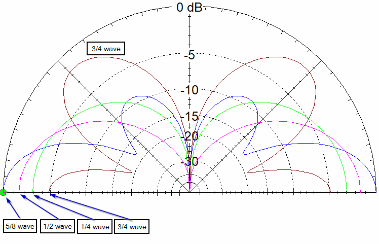

## Wykorzystany sprzęt

* Raspberry Pi 5 (8GB ram &#8594; overkill)
    * zasilacz usb-c 27W
    * obudowa z wentylatorem
    * SSD SATA 240GB (*) + adapter USB-SATA Ugreen
* RTL-SDR V3
* antena Diamond BC100S
* przewód antenowy (aktualnie RG174, docelowo najlepiej RG58)
* tani, chiński wzmacniacz szerokopasmowy [SPF5189Z](https://pl.aliexpress.com/item/1005007995348208.html), zmodyfikowany do zasilania przez bias-t
* zestaw adapterów złącz antenowych
    * PL-259 &#8594; SMA female
    * SMA female &#8594; F male
    * F female &#8594; SMA male

(*) dysk 240GB jest zdecydowanie zbyt duży jeśli nie zdecydujemy się na zapisywanie basebandu z odebranych transmisji. Domyślnie ta opcja jest wyłączona, a pliki (nazywane [artefaktami](https://wiki.satnogs.org/Artifacts)) po wysłaniu na serwery satNOGS są usuwane z pamięci lokalnej.

## Antena
Antena Diamond BC-100S jest anteną przeznaczoną do odbioru/nadawania transmisji spolaryzowanych pionowo, w paśmie UHF, z możliwością dostrojenia. Anteny 5/8 $\lambda$ mają charakterystykę bardzo skupioną na horyzoncie, z dużym spadkiem zysku przy ok. 30 i 90 stopniach.

Zródło: [practicalantennas.com](https://practicalantennas.com/designs/verticals/5eights/)

## Konfiguracja środowiska

#### Instalacja systemu na Raspberry
Na dysku należy zainstalować system Raspbian 64 bit za pomocą [Raspberry Pi Imager](https://www.raspberrypi.com/software/). Po wybraniu właściwej płytki, wersji systemu i docelowego dysku, kreator zapyta, czy chcemy customizować instalację. Serwer skonfigurujemy jako <em>headless</em>, więc należy wybrać "<em>edit settings</em>", następnie uzupełnić pole z nazwą użytkownika i hasłem, i ostatecznie włączyć serwer SSH w drugiej zakładce. Po zainstalowaniu systemu na dysku, ten zostanie automatycznie odłączony - można więc go podłączyć do Raspbery i przejść do kolejnego kroku.

#### Konfiguracja środowiska

##### Konfiguracja SSH
Do świeżo uruchomionego Raspberry łączymy się przez ssh, w tym przypadku poprzez polecenie `ssh satpi@192.168.50.26`. Dla ułatwienia pracy zalecane jest wklejenie swojego klucza publicznego do `/home/satpi/.ssh/authorized_keys` - nie będzie trzeba wpisywać za każdym razem ustalonego wcześniej hasła. `satpi` naturalnie należy zmienić na własnego usera.

##### Instalacja klienta VPN
Aby można było połączyć się z Raspberry nawet, gdy zainstalujemy je poza naszą siecią lokalną, lub aby dać do niego dostęp współpracownikom, należy uzbroić je w tunel VPN. W naszym przypadku serwerem VPN jest self-hosted instancja Wireguarda działająca na innym komputerze klasy Raspberry (VPS to dodatkowy koszt, a niektórzy ISP wciąż oferują publiczne adresy IPv4 🙏). Na Raspberry instalujemy Wireguarda:
`sudo apt update && sudo apt upgrade`
`sudo apt install wireguard`
`sudo apt install openresolv` (bez tego wireguard nie utworzy tunelu)

Na serwerze generujemy plik konfiguracyjny klienta wyglądający mniej więcej tak:
<pre>[Interface]
PrivateKey = [...]
Address = 10.154.37.6/24
DNS = 1.1.1.1, 1.0.0.1
[Peer]
PublicKey = [...]
PresharedKey = [...]
Endpoint = [VPN_SERVER_IP]:51820
AllowedIPs = 10.154.37.0/24
PersistentKeepAlive = 25</pre>
I kopiujemy go na Raspberry:
`sudo nano /etc/wireguard/satnogs.conf`

Pole <em>PersistentKeepAlive</em> jest kluczowe. Bez niego ruch z zewnątrz nie dociera do Raspberry, nie da się połączyć z nim przez ssh ani spingować. Problem ustawał tymczasowo po wysłaniu z Raspberry pingu na inną maszynę w sieci VPN. Jest to związane z działaniem firewalla i zamykaniem nieaktywnych połączeń.
Sprawdzamy czy VPN działa jak powinien:
`sudo wg-quick up satnogs`
Upewniamy się czy połączenie zostało prawidłowo nawiązane:
<pre>PING 10.154.37.1 (10.154.37.1) 56(84) bytes of data.
64 bytes from 10.154.37.1: icmp_seq=1 ttl=64 time=0.686 ms
64 bytes from 10.154.37.1: icmp_seq=2 ttl=64 time=0.693 ms</pre>

Wszystko jest ok, więc można skonfigurować Wireguarda jako usługę systemd, żeby tunel tworzył się przy starcie systemu:
<pre>sudo systemctl enable wg-quick@satnogs.service
sudo systemctl start wg-quick@satnogs</pre>
Teraz możemy łączyć się do Raspberry gdziekolwiek będzie miało dostęp do internetu. Będzie to przydatne w momencie przemieszczenia stacji bazowej satNOGS.

#### Instalacja Dockera
Klient satNOGS uruchamiany jest w kontenerze Dockera. Docker został zainstalowany zgodnie z [oficjalnym poradnikiem](https://docs.docker.com/engine/install/debian/#install-using-the-repository). Domyślnie nasz użytkownik nie należy do grupy dockera, i wszystkie polecenia należy wykonywać z wykorzystaniem `sudo`. Aby to zmienić, postępujemy wykonujemy następujące [kroki](https://stackoverflow.com/questions/48957195/how-to-fix-docker-got-permission-denied-issue):
<pre>sudo groupadd docker
sudo usermod -aG docker $USER
newgrp docker
sudo systemctl restart docker</pre>
Weryfikujemy prawidłowe działanie Dockera poleceniem `docker run hello-world`. Powinien zostać pobrany obraz, a w konsoli wyświetli się komunikat informujący o sukcesie.
#### Instalacja klienta satNOGS - wersja minimalna
Uruchamianie klienta satNOGS jako dockerowego kontenera ma wiele zalet:
* konfiguracja przechowywana w jednym pliku
* łatwe zarządzanie zasobami
* skalowalność (można posiadać wiele stacji na jednym serwerze)
* jeśli coś nie zepsujemy, nie "krzywdzimy" konfiguracji systemowej hosta, problem jest self-contained w kontenerze i można go po prostu usunąć i stworzyć od nowa

W tym celu wykorzystamy [oficjalny obraz](https://gitlab.com/librespacefoundation/satnogs/satnogs-client/-/tree/master?ref_type=heads), który wpierw będziemy musieli zbudować.
<pre>sudo apt update && sudo apt install git
git clone https://gitlab.com/librespacefoundation/satnogs/satnogs-client.git
cd satnogs-client
docker compose build</pre> 
Po wykonaniu tych czynności, powinniśmy mieć w pamięci obraz `satnogs-client`. Można to zweryfikować:
<pre>satpi@pi-station:~ $ docker image ls
REPOSITORY                  TAG       IMAGE ID       CREATED         SIZE
satnogs-client              latest    a445945dd4d5   3 hours ago     2.26GB</pre>

Teraz możemy utworzyć w katalogu domowym folder o nazwie adekwatnej nazwie - np. `gs4063` (groundstation 4063, liczba odpowiada id stacji satNOGS). W folderze tworzymy dwa pliki: `compose.yml` i `.env`. Plik `compose.yml` będzie wyglądał tak (bez zmian):
<pre>services:

  rigctld:
    image: 'librespace/hamlib:4.0'
    user: '999'
    read_only: true
    environment:
      MODEL: '1'
    restart: 'unless-stopped'
    command: 'rigctld'

 satnogs_client:
    build:
      context: .
      args:
        GNURADIO_IMAGE_TAG: '${GNURADIO_IMAGE_TAG:-3.8.2.0-satnogs}'
    image: 'satnogs-client'
    user: '500:500'
    read_only: true
    device_cgroup_rules:
      - 'c 189:* rwm'
    command: 'satnogs-client'
    volumes:
      - type: 'tmpfs'
        target: '/tmp'
      - type: 'volume'
        target: '/var/lib/satnogs-client'
      - '/dev/bus/usb:/dev/bus/usb'
      - "./data:/iq"
    restart: 'unless-stopped'
</pre>
Plik ".env" uzupełniamy na wzór poniższego:

<pre>
SATNOGS_API_TOKEN: '...' #uzupełniamy własnym tokenem
SATNOGS_SOAPY_RX_DEVICE: 'driver=rtlsdr'
SATNOGS_ANTENNA: 'RX' #jeśli wybrano rtlsdr, zostawiamy "RX"
SATNOGS_RX_SAMP_RATE: '1.024e6'
SATNOGS_RF_GAIN: "32.8" #tu należy poeksperymentować
SATNOGS_STATION_ID: '4063'
SATNOGS_STATION_ELEV: '160'
SATNOGS_STATION_LAT: '51.2072'
SATNOGS_STATION_LON: '17.4054'
#SATNOGS_LOG_LEVEL: "DEBUG"
SATNOGS_RIG_IP: 'rigctld'
SATNOGS_ROT_ENABLED: "False"
ENABLE_IQ_DUMP: "True" 
IQ_DUMP_FILENAME: "/iq/file"
SATNOGS_POST_OBSERVATION_SCRIPT: "/iq/satnogs-post.sh {{ID}}"
</pre>

Jeśli stacja ma archiwizować odebrane dane (na tym etapie jest to **odradzane!**, lepiej skorzystać z drugiego poradnika), należy ustawić argument `ENABLE_IQ_DUMP` na `True` oraz wskazać ścieżkę, gdzie plik ma zostać zapisany (`IQ_DUMP_FILENAME`). Ścieżka musi być widoczna dla kontenera, oraz kontener musi mieć do niej prawa. W tym celu utworzono folder współdzielony między kontenerem a hostem, razem z  plikiem "file" i nadano mu odpowiednie prawa.

<pre>
mkdir data
touch data/file
sudo chown -R 500:500 data/
</pre> 
Plik z surowymi danymi będzie nadpisywany z każdym kolejnym przelotem satelity. Aby temu zapobiec, należy stworzyć skrypt zmieniający jego nazwę po zakończeniu zapisywania. Skrypt również musi należeć do użytkownika `500` i posiadać flagę wykonywalności - `chmod +x satnogs-post.sh`.

<pre>
#!/bin/bash
IQ_NAME=/iq/"$1".raw
echo "copying IQ file -> $IQ_NAME "
cp /iq/file "$IQ_NAME"
echo "OK copied /iq/file to $IQ_NAME"
</pre>
Teraz archiwalne zapisy przelotów będą zapisywane w folderze `data`. Uwaga - rozmiar folderu będzie rósł szybko, i w 

Kontener uruchamiamy wchodząc w folder z plikiem compose za pomocą komendy `docker compose up -d`.

#### Autoscheduling
W obecnym stanie rzeczy, jakiekolwiek przeloty muszą zostać zaplanowane ręcznie, co nie jest optymalne, jeśli chcemy "zapomnieć" o naszej stacji i dać jej działać w tle. Korzystamy z oficjalnego projektu [satnogs auto scheduler](https://gitlab.com/librespacefoundation/satnogs/satnogs-auto-scheduler).

<pre>
git clone https://gitlab.com/librespacefoundation/satnogs/satnogs-auto-scheduler.git
cd satnogs-auto-scheduler
docker compose build
</pre>
Modyfikujemy lekko plik `docker-compose.yml`:

<pre>
services:
  satnogs_auto_scheduler:
    build:
      context: .
    image: satnogs-auto-scheduler
    user: '999'
    read_only: true
    entrypoint: "/data/entrypoint.sh"
    env_file:
      - ./station.env
    volumes:
      - type: 'tmpfs'
        target: '/tmp'
      - "./data:/data"
</pre>

Plik `station.env` uzupełniamy adekwatnymi kluczami API i numerem ID naszej stacji:
<pre>
# Your SatNOGS station ID
SATNOGS_STATION_ID="4063"

# Your SatNOGS network API token
SATNOGS_API_TOKEN="..."

# Your SatNOGS DB API token (optional, but recommended) (jednak jest wymagane)
SATNOGS_DB_API_TOKEN="..."
</pre>
Klucz API DB pobieramy z tej strony: [db.satnogs.org](https://db.satnogs.org/). W prawym górnym rogu klikamy okrągłą ikonę, a następnie pole "Settings / API Token".

W folderze `data/` tworzymy skrypt `entrypoint.sh`, który będzie co określony czas pobierał dane o przelotach i automatycznie je planował:

<pre>
#!/bin/bash
SLEEP_TIMER=3000
SATNOGS_GS_ID=4063
while true
do
        schedule_single_station.py -s "$SATNOGS_GS_ID" -T -d 1.5
        echo "scheduled something, now sleeping for $SLEEP_TIMER seconds"
        sleep "$SLEEP_TIMER"
done
</pre>
`SATNOGS_GS_ID` uzupełniamy o ID naszej stacji, `SLEEP_TIMER` ustawiamy na jakiś czas, w tym przypadku 3000 sekund = 50 minut. Flaga `-d` określa na ile godzin do przodu planujemy obserwacje (1.5h), flaga `-T` musi być obecna, jeśli nasza stacja jest w fazie testowej. Skrypt musi mieć własciciela `999` i flagę wykonywalności.
Kontener uruchamiamy wchodząc w folder z plikiem compose za pomocą komendy `docker compose up -d`.

#### Instalacja klienta satNOGS - wersja "na wypasie" 
SatNOGS to duży projekt, ale jego oficjalne obrazy nie wykorzystują wszystkich możliwości. Skupimy się na forku [kng/satnogs-client-docker](https://github.com/kng/satnogs-client-docker), który rozszerza możliwości oryginalnych obrazów. 
* automatyczne obliczanie samplerate zapisanego basebandu
* rozbudowane skrypt pre- i post-obserwacyjne
* integracja [SatDump](https://github.com/SatDump/SatDump/tree/nightly) - najbardziej wszechstronnego oprogramowania do demodulowania i dekodowania sygnałów satelitarnych
* obsługa pipeline do odbierania obrazów z satelitów Meteor (która okazała się być niedziałająca)
Mimo bycia dość rozbudowanym, projekt jest słabo udokumentowany i wymagał pewnej inżynierii wstecznej i modyfikacji paru plików, aby działał jak powinien.

##### Instalacja obrazu bazowego
Zacznijmy od podstaw. Tworzymy folder o adekwatnej nazwie, np. `gs4063`. Będziemy w nim przechowywać:
* plik `compose.yml`
* plik `station.env`
* folder z repozytorium 
* folder wspóldzielony między hostem a kontenerem

Będąc w folderze `gs4063` klonujemy repozytorium:
<pre>
git clone https://github.com/kng/satnogs-client-docker.git
cd satnogs-client-docker
cd addons
</pre>
Przed zbudowaniem obrazu musimy poprawić parę rzeczy po autorze.

###### Modyfikacja Dockerfile
W pliku `Dockerfile` komentujemy linijki odpowiedzialne za instalacje `satnogs-monitor/monitor` - ten moduł nie jest nam potrzebny, a ma problemy z dependencjami i sypie błędami przy próbie instalacji. 

###### Załączanie bias-t
Jeśli antena podłączona jest do wzmacniacza zasilanego z bias-t (jak w naszym przypadku), musimy zarządzać włączaniem zasilania bias-t w RTL-SDR za pomocą skryptów pre/post. Jeśli nie posiadamy wzmacniacza, ten krok można pominąć. Jeśli nie posiadamy wzmacniacza, a nasza antena jest DC-zwarta (np. antena QFH), **NIE WOLNO** załączać bias-t! Może to uszkodzić wewnętrzną elektronikę SDR.
W skrypcie `scripts/satnogs-pre" dopisujemy linijki:
<pre>
rtl_biast -b 1 > /dev/null
echo "bias tee on"
</pre>
I analogicznie w skrypcie `scripts/satnogs-post`:
<pre>
rtl_biast -b 0 > /dev/null
echo "bias tee off"
</pre>

###### Obsługa SatDump
W skrypcie `scripts/satdump.sh` satdump jest wywoływany z nieprawidłowymi argumentami, naprawmy to:

<pre>
case "$NORAD" in
  "25338") # NOAA 15
    OPT="live noaa_apt $OUT --source net_source --mode udp --port $UDP_DUMP_PORT --satellite_number 15 --samplerate $SAMP --frequency 0"
    ;;
  "28654") # NOAA 18
    OPT="live noaa_apt $OUT --source net_source --mode udp --port $UDP_DUMP_PORT --satellite_number 18 --samplerate $SAMP --frequency 0"
    ;;
  "33591") # NOAA 19
    OPT="live noaa_apt $OUT --source net_source --mode udp --port $UDP_DUMP_PORT --satellite_number 19 --samplerate $SAMP --frequency 0"
    ;;
esac
</pre>
Procesowanie na żywo dla NOAA APT działa jak powinno, natomiast LRPT satelitów Meteor nie działa. Można temu zaradzić poprzez przetwarzanie offline po nagraniu zapisu IQ. Jeszcze tego nie zrobiliśmy, ale mamy to w planach. Tak samo wyniki przetwarzania APT nie są przesyłane do sieci satNOGS, tylko przechowywane lokalnie; temu też zaradzimy.

###### Obliczanie samplerate poszczególnych transmisji
Zmienna środowiskowa `SATNOGS_RX_SAMP_RATE` nie ma wpływu na to, w jakim samplerate zostanie zapisany obraz wodospadu na portalu satNOGS, ani w jakim samplerate zostanie nagrany baseband transmisji. Jest to niepokojące szczególnie dla Meteor LRPT, które ma ok. 115kHz szerokości, a satNOGS nagrywa je w 48kHz, co skutecznie uniemożliwia wykorzystanie takiego materiału do jakichkolwiek celów. Wynika to z tego, że satnogs-client nie posiada w swojej bibliotece [satnogs-flowgraphs](https://gitlab.com/librespacefoundation/satnogs/satnogs-flowgraphs) obsługi `LRPT`, mimo, że ten znajduje się w bazie transmiterów satelitarnych (np. [Meteor M2-4](https://db.satnogs.org/satellite/VSVI-4798-5613-4587-2414#transmitters)). Najprostszy workaround dla tego problemu polega na pobraniu z repozytorium pliku [flowgraphs.py](https://gitlab.com/librespacefoundation/satnogs/satnogs-client/-/blob/master/satnogsclient/radio/flowgraphs.py) i zmodyfikowaniu go, aby transmisje `LRPT` były obsługiwane przez pipeline np. `FSK`. Może to powodować powstawanie fałszywych danych, ponieważ LRPT to sygnał modulowany BPSK, ale nie ma to wpływu na zapis baseband IQ.
Zmodyfikowany plik `flowgraphs.py` zamieszczono w folderze z dokumentacją. Tuż przed końcem pliku `Dockerfile` należy dodać dyrektywę:
<pre>
COPY flowgraphs.py /usr/local/lib/python3.9/dist-packages/satnogsclient/radio/
</pre>

##### Budowanie obrazu 
Wchodzimy w katalog `satnogs-client-docker/addons` zawierający `Dockerfile` i za pomocą komendy:
<pre>
docker build --build-arg BUILD_SATDUMP=1 -t lsf-addons-satdump .
</pre>
budujemy obraz o nazwie `lsf-addons-satdump`. SatDump to naprawdę duży program, w związku z czym instalacja może trwać nawet do 30 minut (Raspberry Pi 5). Gdy będziemy chcieli zmienić coś w obrazie, np. zmodyfikować skrypty, kolejne budowanie będzie o wiele krótsze (parenaście sekund), ponieważ Docker przechowuje poszczególne etapy budowania obrazu w cache.

##### Uruchomienie kontenera
Domyślny plik `docker-compose.yml` modyfikujemy według poniższego wzoru. Należy utworzyć folder `data` i zmienić jego właściciela na `500:500`.

<pre>
services:

  rigctld:
    image: librespace/hamlib:latest
    user: '999'
    read_only: true
    environment:
      MODEL: '1'
    restart: 'unless-stopped'
    command: 'rigctld'

  satnogs_client:
    image: lsf-addons-satdump  # nasz zbudowany obraz
    user: '500' # zmiana z 999
    init: true  # init is needed when launching processes in the background
    env_file:
      - ./station.env
    environment:
      SATNOGS_RIG_IP: 'rigctld'
      SATNOGS_RIG_PORT: '4532'
      FFTW_WISDOM: '/data/.fftw_wisdom' # prawdopodobnie niepotrzebne
    command: 'satnogs-client'  # default
    device_cgroup_rules:
      - 'c 189:* rwm'
    devices:
      - '/dev/bus/usb'
    volumes:
      - type: 'tmpfs'
        target: '/tmp'
      - type: 'volume'
        source: 'satnogs-client'
        target: '/var/lib/satnogs-client'
      - "./data:/data" # folder wspólny z hostem
    restart: 'unless-stopped'
    stop_grace_period: 1s
volumes:
  satnogs-client:  # persistent named volume for the station
</pre>

Plik `station.env` tworzymy analogicznie jak poprzednim razem, dodajemy dodatkowe flagi:

<pre>
SATNOGS_API_TOKEN='...' # klucz API satnogs
SATNOGS_SOAPY_RX_DEVICE= 'driver=rtlsdr'
SATNOGS_ANTENNA= 'RX' #domyślna wartość dla RTL-SDR
SATNOGS_RX_SAMP_RATE= '1.024e6' #szerokość samplowania 1MHz jest ok, 250kHz będzie zbyt wąskie
SATNOGS_RF_GAIN= "32.8" #eksperymentalnie dobrany gain
SATNOGS_STATION_ELEV= '160'
SATNOGS_STATION_ID= '4063'
SATNOGS_STATION_LAT= '51.2'
SATNOGS_STATION_LON= '17.4'
SATNOGS_ROT_ENABLED: "False"
#SATNOGS_LOG_LEVEL=INFO
SATNOGS_PRE_OBSERVATION_SCRIPT=satnogs-pre {{ID}} {{FREQ}} {{TLE}} {{TIMESTAMP}} {{BAUD}} {{SCRIPT_NAME}}
SATNOGS_POST_OBSERVATION_SCRIPT=satnogs-post {{ID}} {{FREQ}} {{TLE}} {{TIMESTAMP}} {{BAUD}} {{SCRIPT_NAME}}
UDP_DUMP_HOST=0.0.0.0

#ścieżki będą potrzebne jeśli zechcemy wysyłać do bazy satnogs obrazki pozyskane z satdumpa
SATNOGS_OUTPUT_PATH="/data/app/data"
SATNOGS_COMPLETE_OUTPUT_PATH="/data/app/data/complete"
SATNOGS_INCOMPLETE_OUTPUT_PATH="/data/app/data/incomplete"
SATNOGS_APP_PATH="/data/app"

#iq dump potrzebny do offline'owego procesowania w satdump
ENABLE_IQ_DUMP="True"
IQ_DUMP_FILENAME="/data/iq"
IQ_DUMP_RENAME="True"
IQ_DUMP_COMPRESS="True"

#aktualnie satdump działa tylko dla NOAA APT
SATDUMP_ENABLE="True"
SATDUMP_KEEPLOGS="Yes" # tajemniczo skrypt akceptuje tylko "yes"????
</pre>

Kontener odpalamy za pomocą `docker compose up -d`. Najlepiej poczekać do kolejnej obserwacji i sprawdzić w logach czy wszystko działa jak powinno - w czasie uruchamiania ujawni się nazwa naszego kontenera, wpisujemy komendę `docker logs nazwa`. W trakcie dobrej obserwacji powinniśmy widzieć:
<pre>
[R82XX] PLL not locked!
[INFO] Using format CF32.
Allocating 15 zero-copy buffers
</pre>
A po jej zakończeniu:
<pre>
netrigctl_close: done status=Command completed successfully
</pre>
Zaś na stronie [network.satnogs.org](https://network.satnogs.org/) w zakładce z naszymi obserwacjami po ok. 3 minutach (domyślny czas po jakim odświeża się zadanie wysłania [artefaktów](https://wiki.satnogs.org/Artifacts)) powinien pojawić się wodospad FFT.

